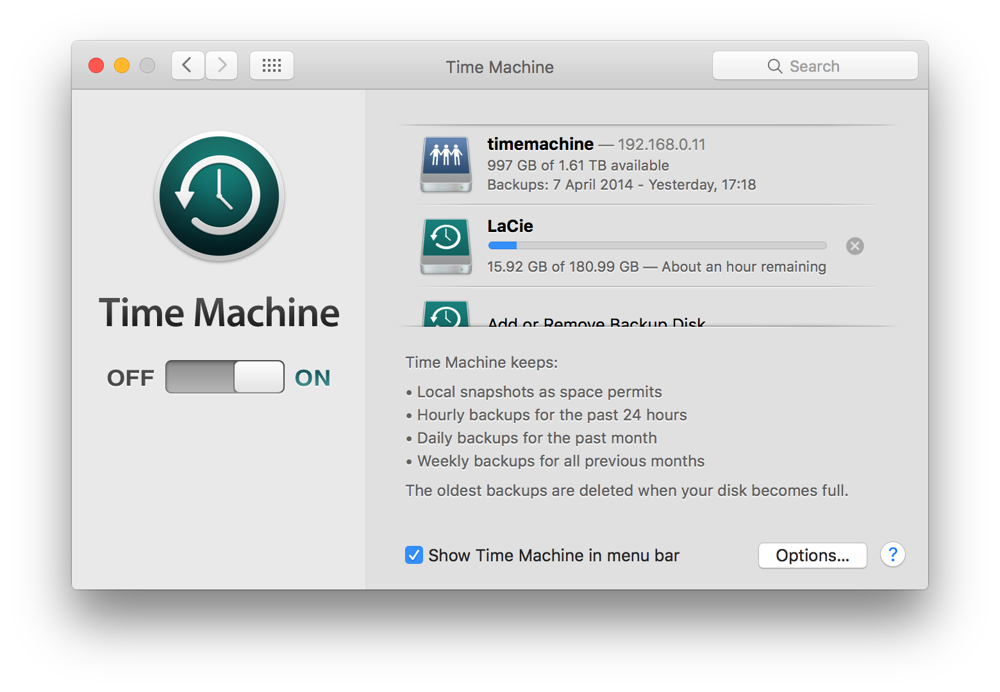

# blog
experimental blog using github

Idea : use the github commit history to determine updates to a blog post. Work out some conventions and stick to them, build a simple site, or use the static site generator? At least should give me somewhere to jot down tech-geek thoughts when out for a walk to get a good  c[_] of coffee.

## January 2017

### speeding up backups on mac

#### 26.01.17

My backups started running very slowly, even when I was backing up to a local USB disk, and would sometimes look like they had 'hung' for hours. The following fixed it for me.

**It's such a Pity Moore's Law never applied to backups!**

- use external usb 3 on a thunderbolt connection, don't do over network. (obvious)
- exclude your `java android sdk` folders, these contain gigabyte files. (You'll have some big files here if you do any android, xamarin, ios, ionic dev work.)
- close and quit `dropbox` when doing the really big first time (backup). (I still need to investigate whether dropbox has or is causing my backups to hang. TBD) My backup was hanging for almost 20 minutes, and only when I stopped dropbox did it continue again. (this could be co-incidence, need to check.) Might need to do this everyday. 
- I do not recommend excluding dropbox folders from timemachine backups since you'll be relying on dropbox history, when needing to restore to a previous version. (**To be investigated, not sure if DB is a real issue causing hanging.**)
- exclude any vmware, virtualbox files, etc.
- temporarily disable sophos `live protection`. At the very least disable during the first big backup, backing up for the first time.
- In some circumstances, test to see if helps, can temporarily give backup process higher priority `sudo sysctl debug.lowpri_throttle_enabled=0`. (I believe this might give ***all*** debug processes higher priority, so this needs further investigation)
- when finished backing up, restart, reboot or reset debug priorities.  `sudo sysctl debug.lowpri_throttle_enabled=1` (not 100% certain if this is correct?)
- Result? I've gone from a backup not being able to calculate the time remaining (0 Mb / second), to 8 hours (13 Mb / second)  finally to around (111 Mb per second, sustained!) , which is about right, and really hard to do actually. 
- most hard drives will backup really quickly for a few minutes, then their internal buffers (or whatever) get saturated, and it invetably slows down to around 30Mb/second for most hardware and ports. Super difficult to get a really long sustained transfer rate lasting for close on an hour. 

***TL;DR***

- apparently if you want to do 1 thing only, then disable ***SOPHOS live protection*** during backups, this seems to be the biggest cause of headaches.



----

### 8 simple 1 line commands to gaurantee a super interesting dev meetup `¯\_(ツ)_/¯`

#### 27.01.17

```
 npm install -g ionic cordova 
  ionic start myapp tabs --v2 --ts
  cd myapp
  ionic serve
  ionic platform add android
  ionic build android
  ionic emulate android
  ionic run android
```

[copied from my notes while playing with ionic2.](https://github.com/goblinfactory/study-ionic-sandbox)