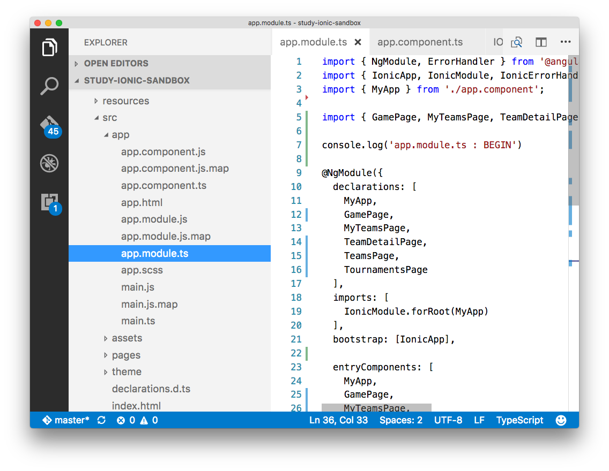

## VSCode extensions ( declutter the IDE, stress reliever)

* Peep (`@mwallace`)
 - quickly toggle between hiding and showing files defined in your projects files.exclude setting.
 - my personal settings (below) will hide the `.js` and `.map` files in an ionic2 project, so that I can go from this
  - 
  - to
  - 
 - *installing*
  - https://marketplace.visualstudio.com/items?itemName=nwallace.peep
  - make a `.vscode` folder in the root of your project.
  - add a `settings.json` file. This is my exclude filter. (update of course if you put your project files elsewhere.)

```
{
  "files.exclude": {
    "**/app/*.js": true,
    "**/app/*.map": false
  }
}

```

 - press `cmd+shift+p` and enter `peep toggle` to toggle hiding or showing the `.map` and `.js` files. In a big `Ionic2` project, this makes quite a difference. 