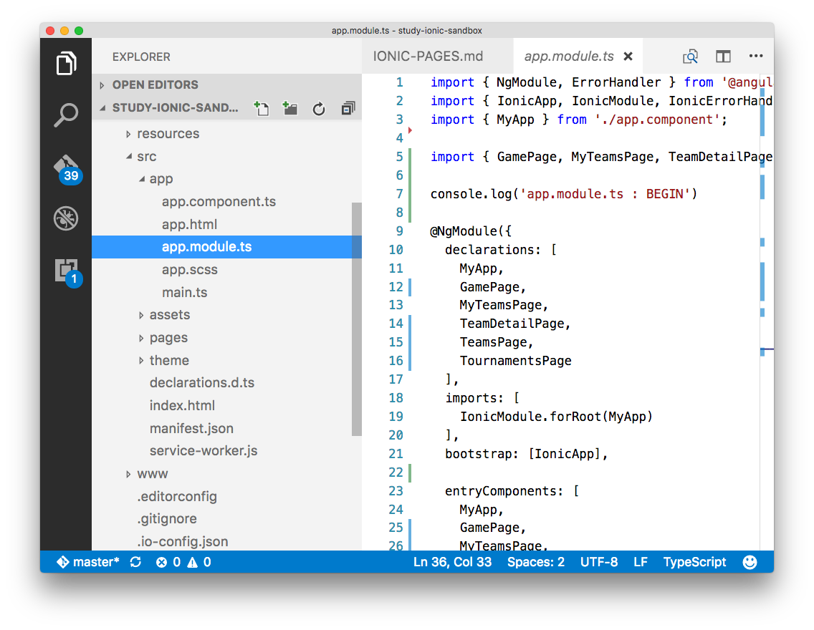

## VSCode extensions ( declutter the IDE, stress reliever)

* Peep (`@mwallace`)
 - quickly toggle between hiding and showing files defined in your projects files.exclude setting.
 - my personal settings (below) will hide the `.js` and `.map` files in an ionic2 project, so that I can go from this
  - 
  - to
  - 
 - *installing*
  - https://marketplace.visualstudio.com/items?itemName=nwallace.peep
  

```
{
  "files.exclude": {
    "node_modules/": false,
    "dist/": false,
    "lib/": false
  }
}

```