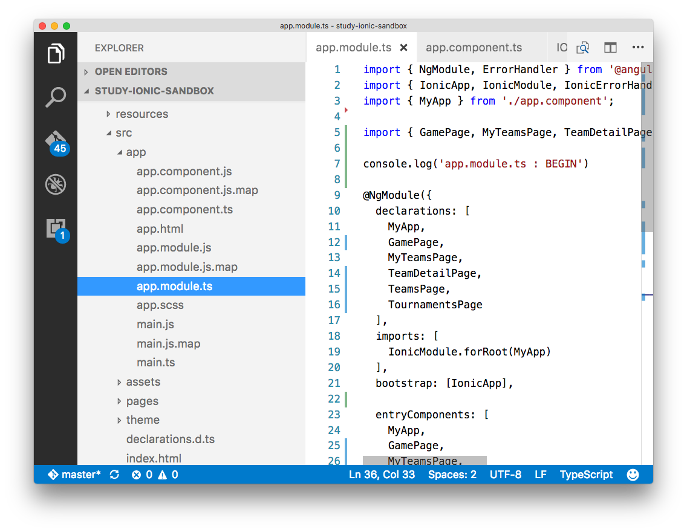

# ionic2 dev settings

- lots of potential (food for thought) for good yeoman tasks, 'yo fix up this mess!'
- a few misc general development items, not specifically Ionic.

## VSCode extensions ( declutter the IDE, stress reliever)

* Peep (`@mwallace`)
 - quickly toggle between hiding and showing files defined in your projects files.exclude setting.
 - my personal settings (below) will hide the `.js` and `.map` files in an ionic2 project, so that I can go from this
  - 
  - to
  - 
 - *installing*
  - https://marketplace.visualstudio.com/items?itemName=nwallace.peep
  

```
{
  "files.exclude": {
    "node_modules/": false,
    "dist/": false,
    "lib/": false
  }
}

```

## Yeoman generators

## hiding showing files

> `defaults write com.apple.finder AppleShowAllFiles TRUE`

After running the command, alt+right click on finder and select relaunch.


