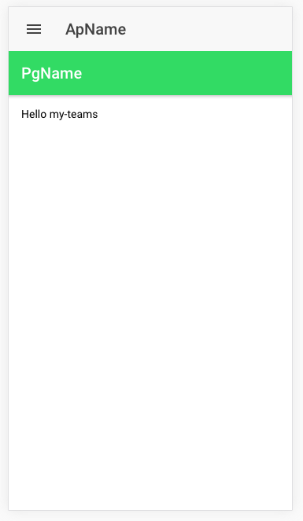

# Ionic2 1 liner emmet start page

`VSCode` [supports `Emmet` natively out of the box](http://docs.emmet.io/), so, just for fun, how far can emmit really go? here's a few (`1 for now`) Ionic2 emmets. 

```
ion-header>ion-navbar>button[ion-button][menuToggle]>ion-icon[name=menu]^ion-title{ApName}^ion-toolbar[color=secondary]>ion-title{PgName}
```

**produces**

```html
<ion-header>
  <ion-navbar>
    <button ion-button="" menuToggle="">
      <ion-icon name="menu"></ion-icon></button>
    <ion-title>ApName</ion-title>
  </ion-navbar>
  <ion-toolbar color="secondary">
    <ion-title>PgName</ion-title>
  </ion-toolbar>
</ion-header>
```

**which gives you this basic starter Ionic2 page**




### References

* http://docs.emmet.io/cheat-sheet/
