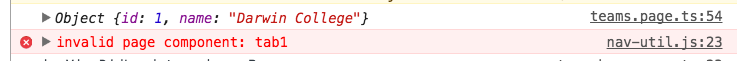

> `invalid page component: tab1` (or your tab name)


**Possible cause**
> leaving out the square brackets in the tab control will give you this error. Hard to spot even when you're looking straight at the code

```
<ion-tabs>
  <ion-tab root="tab1"></ion-tab>
  <ion-tab root="tab2"></ion-tab>
</ion-tabs>
```

**Possible fix**

> put back the square brackets

```
<ion-tabs>
  <ion-tab [root]="tab1"></ion-tab>
  <ion-tab [root]="tab2"></ion-tab>
</ion-tabs>
```



### Home

[back to my experimental blog](../../README.md)