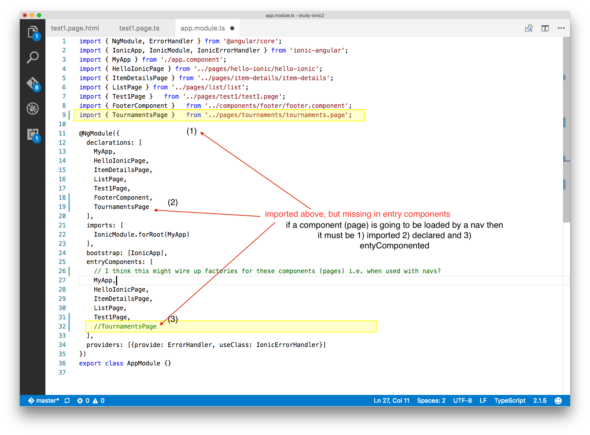

> `Error in ./Test1Page class Test1Page - caused by: No component factory found for YourNewlyCreatedThingPage`

**Possible cause**
> - you created a new page, and added it to `src/app/app.module.ts` -> `imports` and `@NgModule` 's `declarations` but did not add it to the `entryComponents:`. Possibly as part of a dynamically loaded page using an ionic `nav`. 

**Possible fix**

> - Add the page to the `entryComponents`

